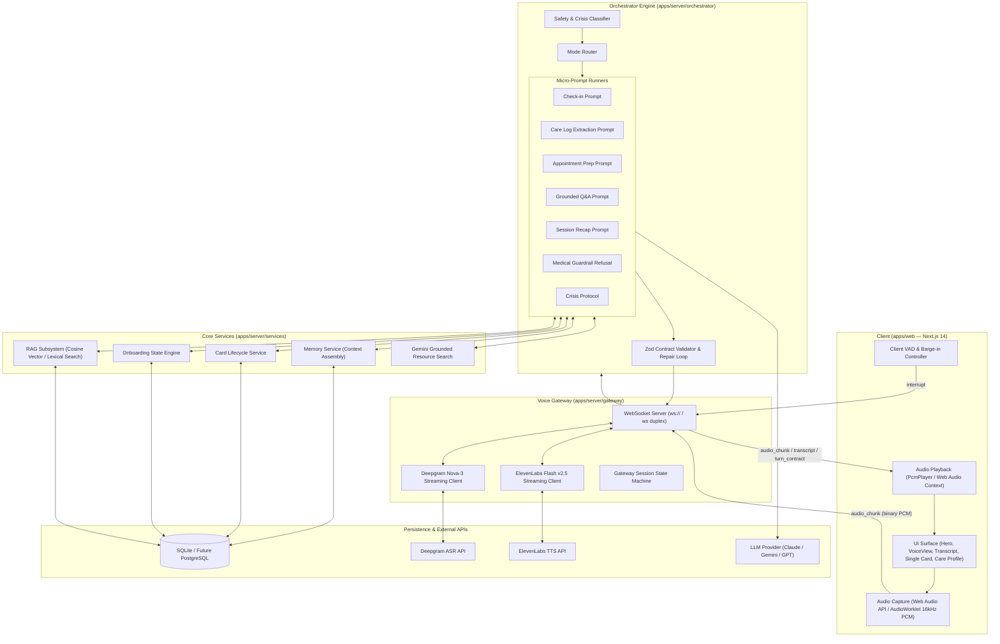
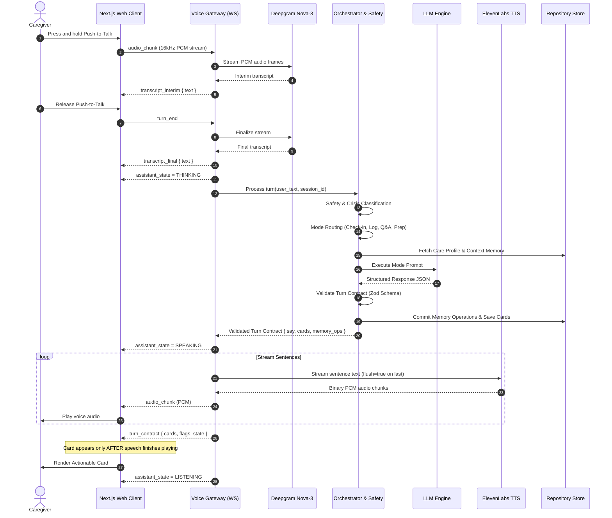
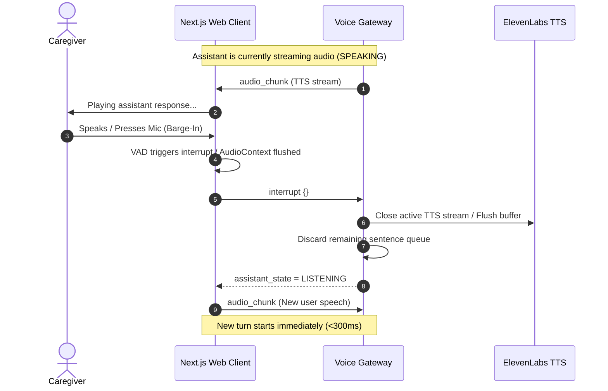
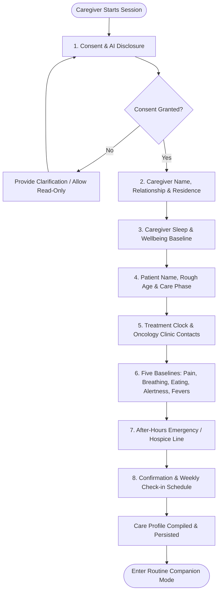
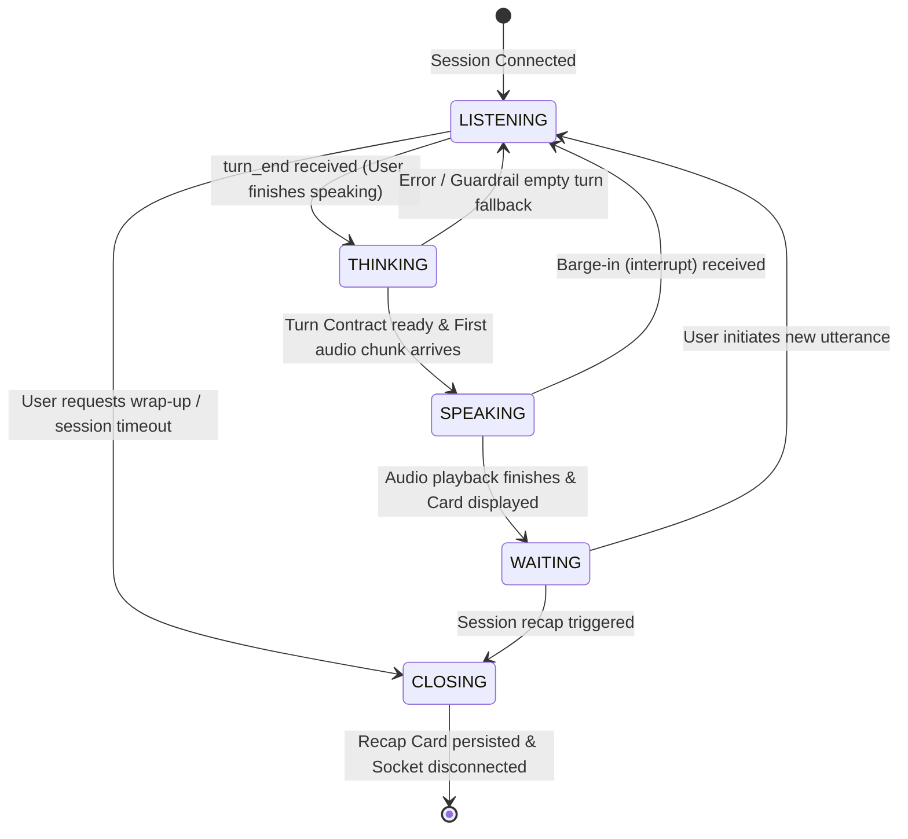
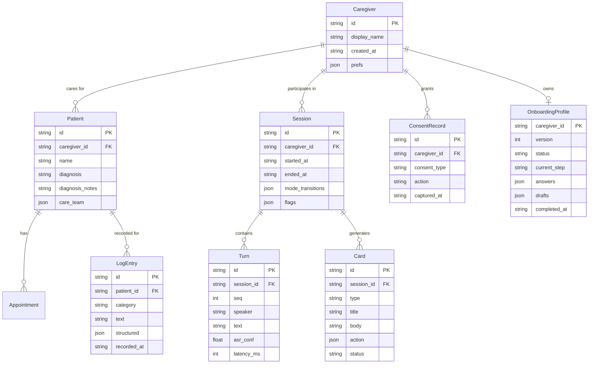

# Turtle — Voice-First Caregiver Companion

> **"Voice is the medium, cards are artifacts."**

Turtle is an intelligent, voice-first companion designed to support family caregivers caring for loved ones with terminal illness and palliative care needs. Turtle provides proactive check-ins, structured symptom and medication logging, appointment preparation, grounded palliative care Q&A, trusted resource discovery, and emergency escalation — while strictly maintaining the boundary of being empathetic software, never a medical professional.

---

## Table of Contents

- [Key Features](#key-features)
- [System Architecture](#system-architecture)
- [Workflows & Sequence Diagrams](#workflows--sequence-diagrams)
  - [1. Realtime Voice & Turn Lifecycle](#1-realtime-voice--turn-lifecycle)
  - [2. Low-Latency Barge-In Interruption](#2-low-latency-barge-in-interruption)
  - [3. Conversational Voice Onboarding Workflow](#3-conversational-voice-onboarding-workflow)
  - [4. Session & Assistant State Machine](#4-session--assistant-state-machine)
- [System Design & Component Model](#system-design--component-model)
- [Data Models & Response Contract](#data-models--response-contract)
- [Project Structure](#project-structure)
- [Getting Started & Local Development](#getting-started--local-development)
  - [Zero-Key Degraded Mode](#zero-key-degraded-mode)
  - [Voice Diagnostics](#voice-diagnostics)
  - [Trusted Caregiver Resources](#trusted-caregiver-resources)
  - [Available Scripts](#available-scripts)
- [Future Deployment & Production Roadmap](#future-deployment--production-roadmap)

---

## Key Features

- 🎙️ **Conversational Voice Onboarding:**
  - 100% voice-driven, ~10-15 minute empathetic intake call.
  - Multi-step state machine covering informed AI & data consent, caregiver relationship & wellbeing, patient care phase, treatment timelines, care team escalation numbers, and baseline symptoms.
  - Live structured **Care Profile** extraction and real-time interactive UI updates.

- ⚡ **Ultra-Low Latency Streaming Voice Pipeline:**
  - Push-to-talk audio capture using Web Audio API and AudioWorklets (16kHz mono PCM).
  - Deepgram Nova-3 streaming ASR with interim transcripts and endpointing.
  - ElevenLabs Flash v2.5 streaming TTS with sentence-by-sentence streaming, chunk schedules, and turn flushes.
  - Sub-300ms **Barge-In**: caregiver speech immediately interrupts assistant audio playback without penalty.

- 🧠 **Modular Multi-Mode Orchestrator:**
  - **Zero God-Prompts**: Routed architecture with specialized micro-prompts.
  - **Safety Classifier & Guardrails**: Evaluates raw utterances first. Refuses medical diagnosis/prescriptions and provides validated redirects to the care team.
  - **Crisis Protocol**: Detects acute distress or emergency triggers, immediately surfacing 988 Suicide & Crisis Lifeline / 911 resources in voice and persistent UI cards.
  - **Check-in Mode**: Empathetic, memory-aware check-in tracking caregiver sleep and burden.
  - **Care Log Mode**: Verbatim symptom/medication logging with structured categorization (no ungrounded interpretation).
  - **Appointment Prep Mode**: Summarizes recent symptoms into structured briefing sheets for oncology/palliative visits.
  - **Grounded Q&A (RAG)**: Retrieves from curated palliative care knowledge bases; strictly drops ungrounded claims.
  - **Trusted Resource Discovery**: Grounded search via Google Gemini for vetted local support groups, financial assistance, respite care, and transportation.

- 🗂️ **Single-Surface Actionable Artifacts (Cards):**
  - Strict UI invariant: **At most one active card** at any time to minimize cognitive overwhelm.
  - Cards render only *after* the assistant completes the corresponding spoken utterance.
  - Actionable buttons (one-tap dial for hospice nurses, links to support services, recap cards).

- 🔒 **Privacy, Consent & Safety-First Posture:**
  - Explicit multi-step consent capture for AI interaction and caregiver data processing.
  - Ephemeral audio handling (raw audio discarded immediately after ASR).
  - One-click **"Delete Everything"** button for immediate data eradication.
  - Fully runnable with **Zero API Keys** through comprehensive graceful degradation fallbacks.

---

## System Architecture

Turtle uses a unified monorepo structure with a clear boundary between the web client, the streaming voice gateway, the orchestration engine, and internal subsystem services.



---

## Workflows & Sequence Diagrams

### 1. Realtime Voice & Turn Lifecycle

Every spoken user turn progresses through streaming speech recognition, safety evaluation, mode-specific LLM reasoning, response contract validation, and sentence-streamed speech synthesis.



---

### 2. Low-Latency Barge-In Interruption

When a caregiver speaks or taps interrupt while Turtle is speaking, playback is cancelled instantly, the partial turn is discarded, and the system resets to listening within 300ms.



---

### 3. Conversational Voice Onboarding Workflow

The onboarding engine conducts a continuous voice intake dialog without demanding complex form completion.



---

### 4. Session & Assistant State Machine



---

## System Design & Component Model

### Monorepo Structure

```text
├── apps/
│   ├── web/                     # Next.js 14 React client
│   │   ├── app/                 # App Router (page.tsx, layout.tsx)
│   │   ├── components/          # UI: VoiceView, OnboardingCard, CareProfile, Transcript
│   │   ├── lib/                 # Web Audio capture worklets, PcmPlayer, VAD, state hooks
│   │   └── public/              # Brand assets, Turtle SVG logo
│   └── server/                  # Node.js + TypeScript Backend Service
│       ├── src/
│       │   ├── gateway/         # WebSocket server, Deepgram ASR, ElevenLabs TTS, Barge-in
│       │   ├── orchestrator/    # Safety classifier, mode router, micro-prompts, evals
│       │   ├── onboarding/      # Conversational onboarding state engine
│       │   ├── services/        # Memory, RAG (vector/lexical), Card service, Gemini search
│       │   ├── store/           # SQLite repositories & migration schema
│       │   ├── http/            # REST control plane routes (/health, /sessions, /cards)
│       │   └── config.ts        # Environment validation & graceful degradation config
├── packages/
│   └── shared/                  # Universal TypeScript types & schemas
│       ├── src/
│       │   ├── contract.ts      # Zod Turn Response Contract
│       │   ├── messages.ts      # WebSocket protocol message definitions
│       │   ├── onboarding.ts    # Onboarding profile & step definitions
│       │   └── index.ts
├── kb/                          # Curated Palliative Care Markdown Knowledge Base
│   └── metastatic-cancer/       # Symptom management, communication, hospice guides
├── e2e/                         # Playwright end-to-end integration tests
├── Dockerfile                   # Production container definition
├── railway.json                 # Railway deployment configuration
└── render.yaml                  # Render deployment configuration
```

---

## Data Models & Response Contract

### The Turn Response Contract

The central spine of the system is the strictly typed `TurnResponseContract`, validated with Zod before speech synthesis or client dispatch:

```typescript
export interface TurnResponseContract {
  session_id: string;
  turn_id: string;
  state: 'LISTENING' | 'SPEAKING' | 'WAITING' | 'CLOSING';
  say: string;                           // Spoken text (concise, natural, plain sentences)
  cards: Array<{
    type: 'actionable' | 'retained' | 'safety' | 'onboarding';
    title: string;
    body: string;
    action?: {
      kind: 'call' | 'link' | 'acknowledge' | 'share';
      target: string;
      label?: string;
    };
    expires_at?: string | null;
  }>;                                    // Invariant: Max 1 active card per turn in MVP
  memory_ops: Array<{
    op: 'append_log' | 'set_fact' | 'update_profile' | 'record_consent';
    category?: string;
    text?: string;
    key?: string;
    value?: any;
    at?: string;
  }>;
  flags: Array<'crisis' | 'medical_refusal' | 'degraded_mode' | 'none'>;
}
```

### Database Schema (SQLite / PostgreSQL-ready)



---

## Getting Started & Local Development

### Prerequisites

- **Node.js** >= 20.0.0
- **npm** >= 10.0.0

### Installation & Setup

```bash
# 1. Clone repository
git clone https://github.com/aniketchandekar/turtle-mvp.git
cd turtle-mvp

# 2. Install dependencies across all workspaces
npm install

# 3. Configure environment variables (optional - app boots in degraded mode with 0 keys)
cp .env.example .env

# 4. Start local development server (Server on :8080 or :8787, Next.js on :3000)
npm run dev
```

Open [http://localhost:3000](http://localhost:3000) in your browser.

---

### Zero-Key Degraded Mode

Turtle is engineered with resilience at its core. If any external API key is missing or fails, the system automatically falls back without crashing:

| Missing Environment Variable | Fallback Behavior |
|---|---|
| `DEEPGRAM_API_KEY` | Text-in mode enabled (type in transcript bar; voice-out still works if TTS available). |
| `ELEVENLABS_API_KEY` | Text-only mode (assistant responses appear instantly in transcript and cards). |
| `GEMINI_API_KEY` / `ANTHROPIC_API_KEY` / `OPENAI_API_KEY` | Deterministic canned orchestrator replies allow full UI and card pipeline testing. |
| `OPENAI_API_KEY` (Embeddings) | Local lexical (keyword BM25-style) search over markdown KB chunks. |
| `GEMINI_API_KEY` (Search) | Trusted caregiver web search disabled; falls back to curated offline KB. |

Check system status anytime at `GET /health`.

---

### Voice Diagnostics

Structured, privacy-safe telemetry is emitted in development to inspect real-time voice boundaries:
- **Browser:** Console logs prefixed with `[turtle:voice]`.
- **Server:** JSON stdout logs where `evt` starts with `voice_`.
- **Privacy Guarantee:** Telemetry records timestamps, state transitions, audio chunk counts, and byte sizes — **never** transcript text, audio samples, or PII.

---

### Available Scripts

```bash
npm run dev          # Run Server (:8080) and Web (:3000) concurrently
npm run dev:server   # Run Server in watch mode
npm run dev:web      # Run Next.js Web app in watch mode
npm run typecheck    # Typecheck all workspaces (shared, server, web)
npm run test         # Run unit & orchestrator tests with Vitest (600+ tests)
npm run test:e2e     # Run Playwright end-to-end tests
npm run lint         # Run ESLint across TypeScript & TSX files
npm run format       # Format code with Prettier
npm run build        # Build all workspaces for production
```

---

## Future Deployment & Production Roadmap

### 1. Database & Vector Migration
- **PostgreSQL with `pgvector`**: Transition from local SQLite to managed PostgreSQL (e.g., Supabase, AWS RDS, Neon) with connection pooling.
- **Automated Migrations**: Standardized schema migration tooling (Prisma or Drizzle).

### 2. High-Availability Realtime Architecture
- **Horizontal Scaling with Redis**: Decouple WebSocket connections across multiple Node.js gateway instances using Redis Pub/Sub for session routing and cross-node barge-in synchronization.
- **Edge Deployment**: Deploy web frontend to Vercel Edge Network and Voice Gateway to low-latency container regions near speech provider points-of-presence (SFO/IAD).

### 3. Enterprise HIPAA & BAA Security Tier
- **Zero Data Retention Agreements**: Enforce BAA-tier zero-retention policies with Deepgram, ElevenLabs, and LLM providers.
- **At-Rest & In-Transit Encryption**: AES-256 field-level encryption for care recipient PII and notes; TLS 1.3 for all WebSocket and REST transport.
- **Audit Logging**: Tamper-proof access and consent mutation logging.

### 4. Telephony & Multichannel Integration
- **Twilio / SIP Trunking**: Allow caregivers to dial an inbound phone number or receive scheduled proactive weekly voice check-ins via traditional telephone lines (PSTN) without opening a browser.
- **SMS Care Briefings**: Send post-session actionable cards and oncology appointment prep sheets directly to the caregiver's mobile phone via SMS.

### 5. Multi-Diagnosis Knowledge Base Expansion
- Expand curated palliative care RAG corpora beyond metastatic cancer to include:
  - **Amyotrophic Lateral Sclerosis (ALS)**
  - **Alzheimer's & Advanced Dementia**
  - **Congestive Heart Failure (CHF)**
  - **Chronic Obstructive Pulmonary Disease (COPD)**

---

## License

Private repository — All rights reserved.
